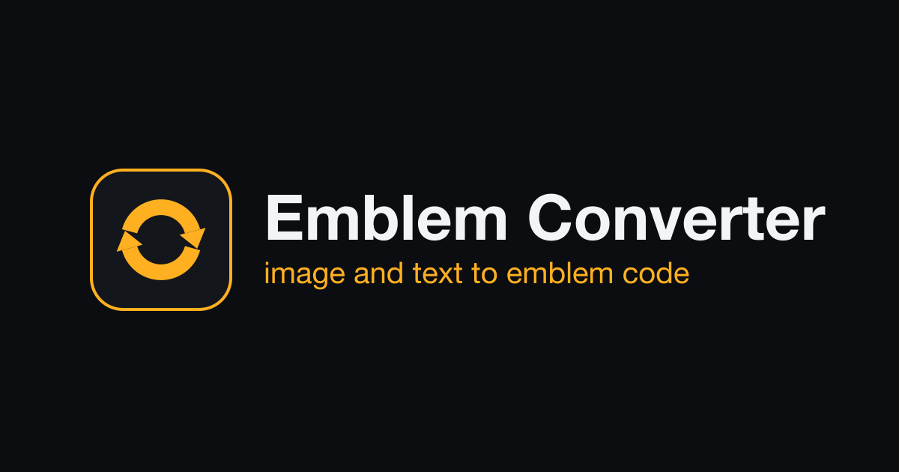

# Emblem Converter

Convert an image or a line of text into the code an emblem editor uses to reproduce it. One HTML page, no build step, no dependency.

**[Live demo](https://f1f2f0e0e4e0ede8ff0e.github.io/emblem-converter/)**

Version 1.0.0

## How it works

An emblem editor stores an emblem as vector data: solid-color rectangles that approximate the picture, plus per-layer metadata. Emblem Converter produces that data from a source and returns a short script that recreates the image when run in the editor's browser console.

1. The source is drawn onto a 512 px canvas and downscaled to a working grid (64 to 512 px).
2. Each row or column is encoded as one rectangle: a solid fill, or a hard-stop linear gradient built from a few color stops. The default engine fits those stops directly on the image; a pixelization mode instead reduces the image to a fixed palette with k-means in the Lab color space and encodes exact color runs.
3. Identical neighboring strips are merged and identical gradients are stored once and reused. SSIM picks horizontal or vertical encoding and fits the output under the editor's size limit.
4. The SVG and layer data are emitted in the format the editor expects, with a minimal layer set and a full set as a fallback.

## Benchmark

[The Compression Benchmark](https://f1f2f0e0e4e0ede8ff0e.github.io/emblem-converter/benchmark.html) rebuilds thirty-five public-domain masterworks as emblem code and sets each beside the original, open to inspection at full resolution.

## Use

Open `index.html` in a current browser, or use the live demo. Drop or paste an image, or switch to text and type. Adjust the options if needed, then copy the generated code and run it in the emblem editor's browser console.

## License

Emblem Converter is released under the [PolyForm Noncommercial License 1.0.0](LICENSE): it may be used, modified, and shared for any noncommercial purpose, provided the copyright notice and license text are retained. Commercial use is not permitted.

The engine that inspired the tool was made by @flashbackgta.
